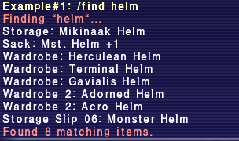
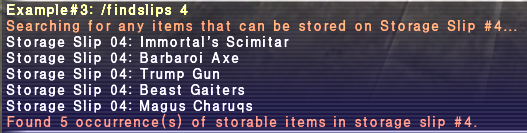
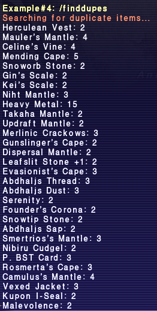
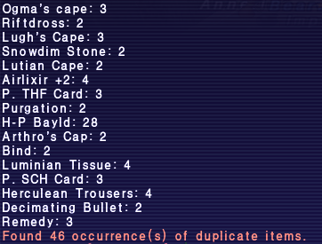

# find

Allows searching for items within a players various storage containers via a slash command (case insensitive).

## Examples ##

```
/find helm
```

Searches all of player's inventory for items whose name contains "helm", including storage slips.


```
/findmore continent
```

Searches all of player's inventory for items whose descriptions contain "continent".


```
/findslips (#)
```

Displays any items in players inventory that can be stored in Storage Slips #1-27. If an optional #1-27 is specified, 
only items that can be stored in that Slip# will  be displayed.



```
/finddupes
```              

Returns list of duplicate items, i.e. which occupy 2 or more inventory slots. (Output is: item name, # of item slots).


